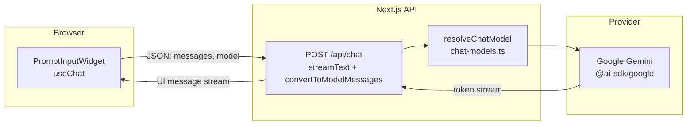

<div align="center">

# chatbot-ai

A **Next.js** chat interface with **streaming** Gemini responses, powered by the [Vercel AI SDK](https://sdk.vercel.ai/) and [Google Generative AI](https://ai.google.dev/).

[](https://nextjs.org/)
[](https://react.dev/)
[](https://www.typescriptlang.org/)
[](https://bun.sh/)

[Features](#features) · [Stack](#stack) · [Quick start](#quick-start) · [Architecture](#architecture) · [Project layout](#project-layout) · [Scripts](#scripts) · [AI SDK DevTools](#ai-sdk-devtools) · [Deployment](#deployment)

</div>

---

## Features

- **Streaming chat** — `streamText` on the server, `useChat` on the client; the UI updates as tokens arrive.
- **Google Gemini** — default model **Gemini 2.5 Flash**; the allowlist and labels live in one place: [`src/lib/chat-models.ts`](src/lib/chat-models.ts).
- **Rich message rendering** — [Streamdown](https://github.com/vercel/streamdown) with add-ons for code, math, Mermaid, and CJK, wired through the `ai-elements` components.
- **Polished input** — attachments, screenshot capture, drag-and-drop, model picker, and a “web search” toggle in the UI (see [`PromptInputWidget`](src/components/widgets/PromptInput/PromptInputWidget.tsx)).
- **Theming & typography** — Tailwind CSS v4, shadcn-style primitives, Geist / Inter in [`src/app/layout.tsx`](src/app/layout.tsx).

## Stack

| Layer        | Tech |
|-------------|------|
| Framework   | [Next.js](https://nextjs.org/) 16 (App Router), React 19 |
| AI          | [`ai`](https://www.npmjs.com/package/ai), [`@ai-sdk/react`](https://www.npmjs.com/package/@ai-sdk/react), [`@ai-sdk/google`](https://www.npmjs.com/package/@ai-sdk/google) |
| UI          | [Tailwind CSS](https://tailwindcss.com/) 4, [Radix UI](https://www.radix-ui.com/) / shadcn-style patterns, [Lucide](https://lucide.dev/) |
| Tooling     | [TypeScript](https://www.typescriptlang.org/) 5, [Biome](https://biomejs.dev/) (lint + format) |
| Package mgr | [Bun](https://bun.sh/) (also works with `npm` / `pnpm` / `yarn`) |

## Quick start

### Requirements

- [Node.js](https://nodejs.org/) 20+ (or [Bun](https://bun.sh/))
- A **Google AI** key for Gemini ([Google AI Studio](https://aistudio.google.com/apikey) or your Vertex setup, depending on how you use `@ai-sdk/google`)

### Environment

Create `.env.local` in the project root:

```bash
# Google Generative AI (used by @ai-sdk/google)
GOOGLE_GENERATIVE_AI_API_KEY=your_key_here
```

Do not commit `.env.local`. In production, set the same variable on your host (e.g. [Vercel environment variables](https://vercel.com/docs/environment-variables)).

### Install and run

```bash
bun install
bun run dev
```

Open [http://localhost:3000](http://localhost:3000).

Production:

```bash
bun run build
bun run start
```

## Architecture



1. The widget sends the conversation and selected `model` to `POST /api/chat`.
2. The route resolves a **Gemini** model id (with a safe fallback) and runs `streamText`.
3. The response is streamed to the client as a UI message stream for `useChat`.

## Project layout

| Path | Role |
|------|------|
| [`src/app/page.tsx`](src/app/page.tsx) | App shell; renders the chat widget |
| [`src/app/api/chat/route.ts`](src/app/api/chat/route.ts) | Chat API: messages in, streamed model out |
| [`src/lib/chat-models.ts`](src/lib/chat-models.ts) | Allowed model ids and `google(id)` |
| [`src/components/widgets/PromptInput/`](src/components/widgets/PromptInput/) | Chat UI: history, prompt, tools |
| [`src/components/ai-elements/`](src/components/ai-elements/) | Reusable chat UI primitives (messages, prompt, code, etc.) |
| [`src/components/ui/`](src/components/ui/) | Base UI building blocks (buttons, dialogs, …) |

## Scripts

| Command        | Action |
|----------------|--------|
| `bun run dev`  | Dev server with hot reload |
| `bun run build`| Production build |
| `bun run start`| Run the production build |
| `bun run lint` | `biome check` |
| `bun run format` | `biome format --write` |
| `bun run devtools` | Start the [AI SDK DevTools](https://www.npmjs.com/package/@ai-sdk/devtools) web UI (run in a second terminal) |

## AI SDK DevTools

Optional local inspector for `streamText` / `generateText`: prompts, tool calls, usage, and timing. The chat route already wraps the model with `devToolsMiddleware()` in [`src/app/api/chat/route.ts`](src/app/api/chat/route.ts).

1. Start the app: `bun run dev` (see [Quick start](#quick-start)).
2. In **another** terminal, start the viewer:

   ```bash
   bun run devtools
   ```

3. Open [http://localhost:4983](http://localhost:4983) to browse captured runs.

The CLI reads the local capture file (under `.devtools/` in the project). DevTools is for **local development only**; do not enable the viewer in production. When you are done, stop the `devtools` process with <kbd>Ctrl</kbd>+<kbd>C</kbd> in that terminal.

## Model configuration

Edit [`src/lib/chat-models.ts`](src/lib/chat-models.ts):

1. Add an entry to `CHAT_MODELS` with `id` and `name`.
2. Ensure the `id` is valid for `google()` from `@ai-sdk/google`.

Unknown `model` values fall back to the default model in that file.

## Deployment

Works on any Node-friendly host. On [Vercel](https://vercel.com/):

1. Connect the repository.
2. Set `GOOGLE_GENERATIVE_AI_API_KEY` in the project’s environment variables.
3. Deploy (build command: `bun run build` or `npm run build`, per your Vercel settings).

`next.config.ts` sets a Turbopack `root` for consistent resolution with Bun/workspaces; adjust if your layout changes.

---

<div align="center">

Built with **Next.js** · Streaming via **Vercel AI SDK** · Models by **Google Gemini**

</div>
